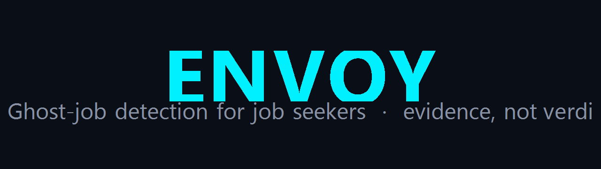
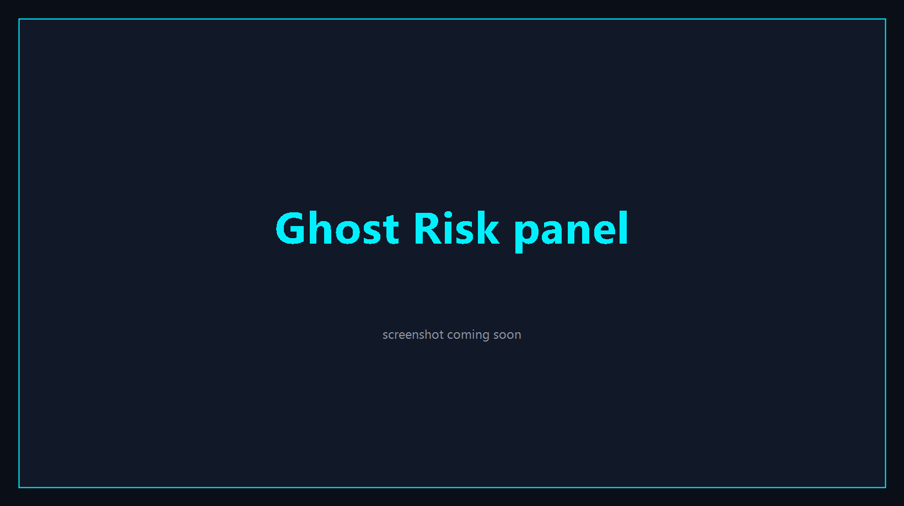
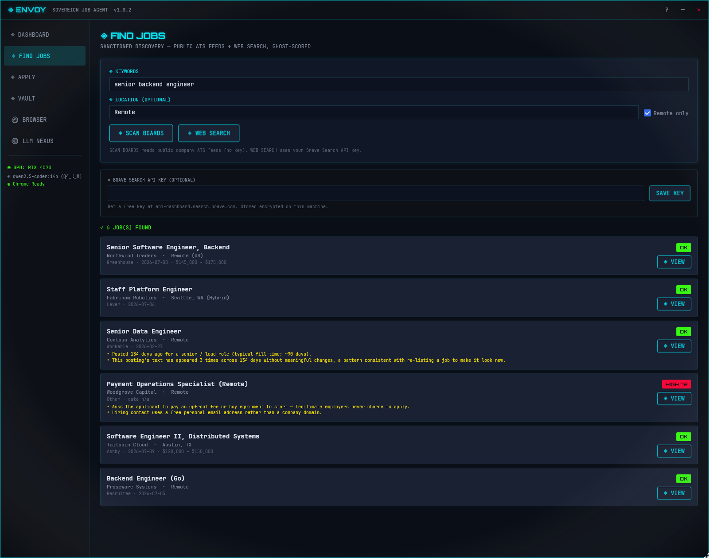
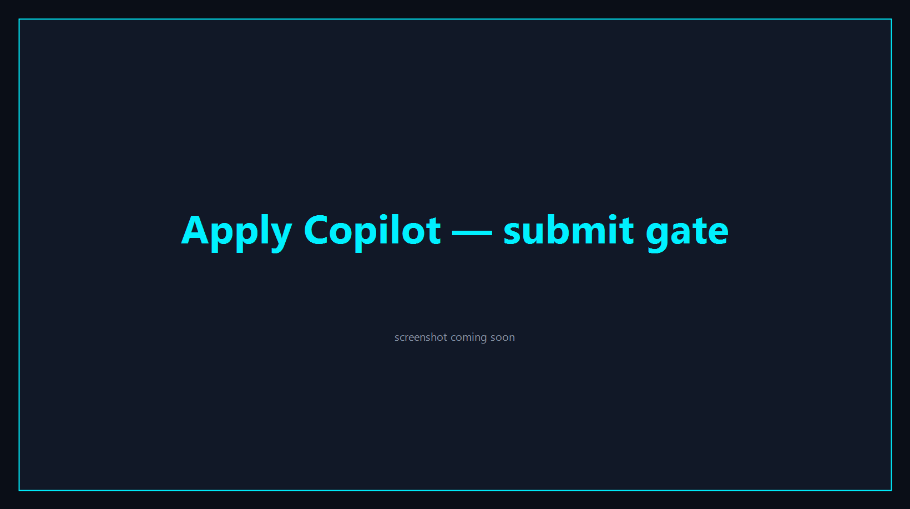

<p align="center">
  
</p>

<h1 align="center">Envoy</h1>

<p align="center">
  <strong>Envoy scores how likely a job posting is a waste of your time, and shows you why.</strong><br>
  It runs on your own Windows PC. Your resume and data never leave it.
</p>

<p align="center">
  
  
  
  
  
  
</p>

<p align="center">
  <a href="https://github.com/LXBStudioLLC/envoy/releases/latest"></a>
</p>

<p align="center">
  <a href="#download">Download</a> ·
  <a href="#early-beta-testers-and-contributors-wanted">Help wanted</a> ·
  <a href="#ghost-detection">How it works</a> ·
  <a href="#find-jobs">Find Jobs</a> ·
  <a href="#apply-copilot">Apply Copilot</a> ·
  <a href="#privacy">Privacy</a> ·
  <a href="#for-developers">Contributing</a>
</p>

---

You tailor the resume, fill out the same fields again, hit submit, and never hear back. Some of those postings were never real openings. Envoy helps you spot them before you waste the afternoon.

## What it does

- Scores how likely a posting is a ghost job and lists the actual reasons behind the score. It won't call a company a fraud. When the evidence is thin, it stays neutral.
- Ghost detection and job search work the second you open it. No account, no API key, no cloud. Your resume stays on your machine.
- It can also tailor your resume and fill out an application for you, but you read it over and click submit yourself. Always.
- Windows 10/11. Signed installer or a portable zip. Nothing else to install.

<p align="center">
  
</p>
<p align="center"><em>The Ghost Risk panel: the band, the score, and the reasons behind it. Demo data shown; company and posting are fictional.</em></p>

---

## Early beta: testers and contributors wanted

Envoy is in early beta. It works end to end and every release is signed, but so far it has run on a small number of machines against a limited slice of real postings. That is the gap you can close.

- **Test it.** Install it, run your real searches, and open an issue for anything that looks wrong: a real job flagged as risky, an obvious ghost scored OK, a crash, a screen that confused you. A five-minute report genuinely moves the project.
- **Contribute.** Five starter issues are open, graded easy to moderate, including two self-contained ghost signals and a new job-board source. [CONTRIBUTING.md](CONTRIBUTING.md) has the step-by-step, including how to hand a signal spec to a coding agent.

Everyone who helps gets credited. Merged PRs are listed in the notes of the release they ship in, and so are the people whose bug reports and test sessions led to a fix. If you would rather not be named, say so in your issue or PR.

---

## Download

[Grab the latest release](https://github.com/LXBStudioLLC/envoy/releases/latest) for Windows 10/11, 64-bit.

| Option | File | Notes |
|---|---|---|
| Installer (recommended) | `Envoy-<version>-setup.exe` | Signed by LXBSTUDIO LLC (Azure Trusted Signing). |
| Portable zip | `Envoy-<version>-win-x64.zip` | Unzip anywhere and run `Envoy.exe`. Nothing to install. |

The build is self-contained, so you don't need the .NET runtime. Every release includes a `SHA256SUMS.txt` if you want to check your download.

Prefer a package manager? [Scoop](https://scoop.sh/) works today:

```powershell
scoop bucket add lxb https://github.com/LXBStudioLLC/scoop-bucket
scoop install lxb/envoy
```

A winget package is under review in the community repo.

The installer is signed, but since the app is new, Windows SmartScreen may warn you the first couple of times until the signature earns some reputation. The publisher will read LXBSTUDIO LLC, and the checksum confirms the rest.

> Ghost detection and Find Jobs work right away with no LLM, no Ollama, and no API key. You only need a local model for the resume-tailoring copilot.

---

## Ghost Detection

Envoy checks each posting with a handful of independent signals. Every signal returns a number, a confidence level, and a plain-English reason, and the app rolls those up into one risk band. There's no bare "fake" stamp on anyone.

Signals come in three tiers:

- **Deterministic** is hard evidence. For example, the role is open on a job aggregator but already closed on the company's own ATS, or the text matches a known scam pattern.
- **Probabilistic** is a strong correlation. For example, the posting has been live far longer than most roles at its level.
- **Weak** is a softer hint that still counts for something. For example, the description is a near-duplicate of another company's post.

Four signals run in the app today, all unit-tested:

| Signal | Tier | Data |
|---|---|---|
| ATS Cross-Check | Deterministic | Network (public Greenhouse and Lever APIs) |
| Posting Age | Probabilistic | Local (posting date from the discovery feed) |
| Duplicate JD | Weak | Local (cross-company text match within a batch) |
| Scam Pattern | Deterministic | Local regex (off-platform redirects, upfront fee or PII asks, crypto and gift-card payment, check and overpayment fraud) |

A fifth signal, Repost Frequency, watches for listings that get re-posted to look new. Its stronger path needs listing history across sessions, which this build doesn't keep yet, but a timestamp fallback can already fire when a posting's own dates show it was bumped long after it first went up.

Each signal says whether it needs the network. That lets Envoy score a whole list locally in the Find Jobs view and save the network calls for when you open a single posting.

### Risk bands

`GhostScorer` combines the signals into one of three bands:

| Band | Meaning | When it triggers |
|---|---|---|
| Neutral | No strong ghost signals. | The default when signals are absent or weak. |
| Elevated | A few signals line up and suggest caution. | Two or more probabilistic signals at 0.60 or higher. |
| High | Strong deterministic evidence that this one may waste your time. | A deterministic signal at 0.80 or higher, with confidence 0.70 or higher. |

Envoy leans toward precision. Flagging a real job is worse than missing a ghost, so when it isn't sure, it stays Neutral. Worth knowing: the Elevated band needs two probabilistic signals, and only Posting Age is active right now, so in practice a posting lands on Neutral or High.

---

## Find Jobs

Envoy has a built-in job search (`Envoy.Discovery`) in the Find Jobs view. It only reads public, unauthenticated sources:

- Public ATS APIs from Greenhouse, Lever, Ashby, Workable, and Recruitee.
- An optional web search through the official Brave Search API. You bring your own key, stored encrypted; without one, search just uses the ATS feeds.

Every posting is scored before it hits your list, so the risk band and the reasons show up right in the results. No scraping behind a login, no bot-evasion, no CAPTCHA solving. Search stays on public endpoints.

<p align="center">
  
</p>
<p align="center"><em>Find Jobs: every result carries its own risk band before you click. Demo data shown; companies and postings are fictional.</em></p>

---

## Apply Copilot

Once you find a posting worth your time, Envoy can help you apply:

- Drop in a resume PDF and it reads and structures the contents with a local LLM.
- It rewrites the resume to fit the specific job description.
- Guardrails catch made-up claims, keyword stuffing, and dates that don't add up.
- Job boards are handled by JSON templates that anyone can update.
- An adaptive parser uses structural fingerprints to keep working when a page's layout shifts.
- The Apply view shows the posting's risk band and reasons before you spend time tailoring anything.

You always press submit. Envoy fills the form and then stops and waits for you to click Confirm or Cancel. That gate holds in every mode, and the default mode is Safe. (Stealth mode only changes how the text is typed. It never skips the confirmation.)

Fuller automation is on the roadmap, and by design it only runs on employer-owned and ATS career sites. Aggregators like LinkedIn and Indeed stay copilot-only. Envoy doesn't solve CAPTCHAs; if a site puts one up, it hands control back to you.

<p align="center">
  
</p>
<p align="center"><em>The copilot fills the form and stops at the gate. Nothing is sent until you confirm. Demo data shown; company and posting are fictional.</em></p>

---

## Privacy

Envoy runs locally by default, using Ollama and a local model. That's the setup we recommend. If you'd rather use a hosted model, it can talk to OpenAI, Anthropic, or Google Gemini instead. Any key you enter is encrypted with Windows DPAPI under your account before it touches disk, and cloud calls only happen when you pick a cloud provider in settings.

## Requirements

- Windows 10 or 11, 64-bit. Envoy is a WPF desktop app, so macOS and Linux aren't supported.
- Ollama, optional, only for the resume copilot. Ghost detection and Find Jobs need no LLM at all.
- Google Chrome or Microsoft Edge installed, for the Apply Copilot.
- A GPU with 8GB or more of VRAM gives the best local-model experience. CPU-only works with smaller models.

---

## For developers

Envoy is a .NET 8 WPF app. The ghost-signal framework is built to be easy to extend, including with a coding agent: open a signal, read exactly why it fired, or write a better one and send a PR.

To add a signal, grab an open [`signal:` issue](https://github.com/LXBStudioLLC/envoy/issues?q=is%3Aissue+label%3Asignal), copy the prompt from [SIGNAL_AUTHORING.md](SIGNAL_AUTHORING.md), hand it to your agent, check the diff, and open a PR. The app finds every `IGhostSignal` at runtime, so there's nothing to wire up.

- Reference signal: [`AtsCrossCheckSignal`](src/Envoy.GhostDetection/Signals/AtsCrossCheckSignal.cs), the Greenhouse and Lever cross-check.
- Worked example: [`PostingAgeSignal`](src/Envoy.GhostDetection/Signals/PostingAgeSignal.cs), built straight from the runbook.
- Open lanes: [hiring freeze](https://github.com/LXBStudioLLC/envoy/issues/5) and [PERM filings](https://github.com/LXBStudioLLC/envoy/issues/1).

Build, architecture, and packaging notes live in [CONTRIBUTING.md](CONTRIBUTING.md) and [AGENTS.md](AGENTS.md).

<details>
<summary><strong>Build from source</strong></summary>

```powershell
dotnet restore
dotnet build -c Release
dotnet test

# Run the app (opens a Windows window)
dotnet run --project src/Envoy.UI
```

If you want the resume copilot, install Ollama and pull a model first:

```powershell
ollama pull qwen2.5-coder:14b
```

</details>

<details>
<summary><strong>Architecture</strong></summary>

| Layer | Technology |
|-------|------------|
| UI | .NET 8 WPF + HandyControl |
| Database | SQLite + EF Core |
| Ghost detection | Signal framework (Deterministic / Probabilistic / Weak) |
| Job discovery | `Envoy.Discovery`: public ATS feeds (Greenhouse, Lever, Ashby, Workable, Recruitee) + optional Brave Search |
| Local LLM | Ollama via [OllamaSharp](https://github.com/awaescher/OllamaSharp) |
| Cloud LLM (optional) | OpenAI / Anthropic / Gemini over HTTP |
| PDF parsing | PdfPig + local LLM cleanup |
| PDF generation | QuestPDF |
| Browser | WebSocket to the Chrome DevTools Protocol |
| Form fill | Plain synthetic input by default; optional human-cadence typing that never skips the confirmation |

</details>

<details>
<summary><strong>Packaging and release</strong></summary>

One command, which reads the version from `Directory.Build.props` and produces the zip, the signed installer, and `SHA256SUMS.txt`:

```powershell
.\build-release.ps1
```

Or the manual steps:

```powershell
.\publish.ps1     # writes artifacts/Envoy-<version>-win-x64.zip
# compile setup.iss with Inno Setup for artifacts/Envoy-<version>-setup.exe
.\install.ps1     # installs the built zip to %LOCALAPPDATA%\Envoy with shortcuts
```

</details>

---

## Feedback and bug reports

Hit a bug or a bad flag? [Open an issue](https://github.com/LXBStudioLLC/envoy/issues/new/choose). Useful reports include your Envoy version, your Windows version, and, if it crashed, the log at `%LOCALAPPDATA%\Envoy\crash.log` (scrub anything personal first). Envoy is tuned for precision, so a real job flagged as a possible ghost is the worst case, and those reports help the most.

## Roadmap

- [x] Ghost-detection signal framework, wired into the app
- [x] Four active signals: ATS cross-check, posting age, duplicate JD, scam pattern
- [ ] Repost frequency signal, full history-backed detection (the timestamp fallback ships today; the stronger path needs listing history across sessions)
- [x] Job search over public ATS feeds plus optional Brave Search, every posting scored
- [ ] More signals: hiring freeze ([#5](https://github.com/LXBStudioLLC/envoy/issues/5)), PERM filings ([#1](https://github.com/LXBStudioLLC/envoy/issues/1))
- [x] Windows zip and signed installer
- [x] Vault view for profile history and corrections
- [x] Adaptive parser with a self-healing element locator
- [x] Cloud LLM providers (OpenAI, Anthropic, Gemini), opt-in, keys encrypted
- [ ] Full-auto apply for employer and ATS sites (aggregators stay copilot-only)
- [ ] Multi-resume and multi-profile support

## License

[AGPL-3.0](LICENSE). Your data stays on your machine.
